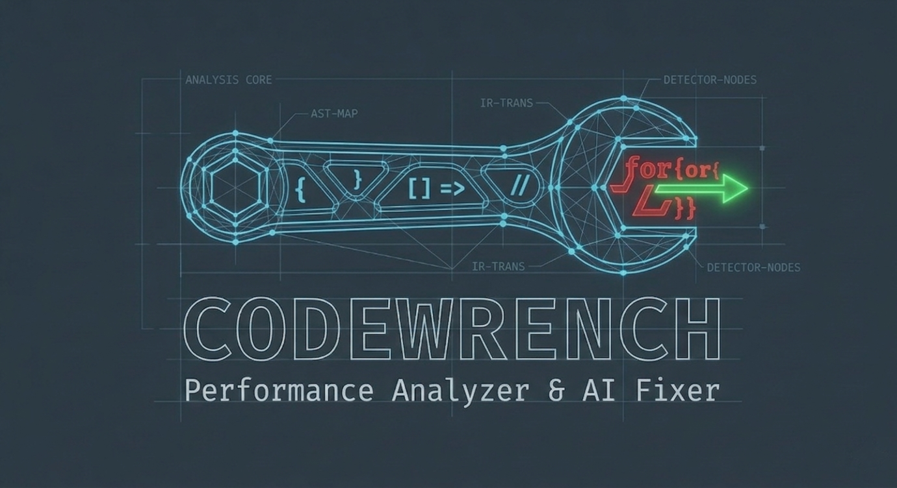

# CodeWrench

<p align="center">
  
</p>

<p align="center">
  
  
  
  
</p>

> Point it at your code. Get back what's slow and how to fix it.

Codewrench is a multi-language performance analyser that combines static analysis with AI-powered explanations. It finds real performance issues in your code — nested loops, N+1 queries, inefficient patterns, bad practices — then explains exactly why they're a problem and shows you the fix.

No cloud, no setup hell, no enterprise pricing. Just run it on a file.

---

## Installation

```bash
pip install codewrench
```

Create a `.env` file in your project root:

```
GROQ_API_KEY=your_key_here
```

Get a free Groq API key at [console.groq.com](https://console.groq.com)

> AI analysis and fixes are optional. Static analysis and profiling work without an API key.

---

## Usage

```bash
codewrench yourfile.py
codewrench app.js
codewrench main.go
codewrench ./myproject
```

Codewrench detects the language from the file extension automatically. Point it at a folder and it walks the entire project.

### CLI flags

```bash
codewrench <file_or_folder>            # static analysis only
codewrench <file> --profile            # + profile original file
codewrench <file> --profile --fix      # + profile before/after AI fix
codewrench <file> --analyse            # + AI explanation of issues
codewrench <file> --fix                # + apply AI fixes to file
codewrench <file_or_folder> --save-report # + save a grouped markdown report
codewrench <file_or_folder> --all      # include low confidence warnings too
codewrench <file> --no-backup          # don't keep .bak when fixing
codewrench --revert <file>             # restore from .bak backup
```

### Example output

```
========================================
           CODEWRENCH REPORT
========================================
Files Scanned  : 1
Languages      : python
Issues Found   : 4 across 1 files
========================================

--- Warnings ---

  Nested loop at line 19 - potential O(n²).
  String concatenation at line 22 — use ''.join() instead.
  re.compile() inside loop at line 31 — move it outside the loop, compile once and reuse.
  Potential N+1 query — 'User.objects.filter' called inside loop at line 45 — consider batching queries or using select_related/prefetch_related.
```

### Saved report

`--save-report` generates `codewrench_report.md` with:

- a summary section at the top
- confidence breakdown for high, medium, and low findings
- top issue types and most affected files
- findings grouped into high, medium, and low confidence sections

Example saved report layout:

```md
# Codewrench Report

## Summary

- Files scanned: 12
- Files with issues: 4
- Total issues: 8
- Languages: python

### Confidence Breakdown

- 🔴 High: 3
- 🟡 Medium: 3
- 🟢 Low: 2

## High Confidence

### app/services.py (2 issues)

- Line 19: Nested loop at line 19 - potential O(n²).
- Line 31: re.compile() inside loop at line 31 — move it outside the loop, compile once and reuse.
```

Use `--all` if you want the report to include low confidence warnings as well.

---

## What it catches

**High priority**
- Nested loops — O(n²) and worse
- N+1 queries — ORM calls inside loops (Django, SQLAlchemy, general DB patterns)
- Expensive I/O calls inside loops (`open`, `requests`, etc.)
- `re.compile()` inside loops — compile once, reuse
- `print()` / logging inside loops — I/O on every iteration
- `await` inside loops — use `asyncio.gather()` or `Promise.all()`
- Repeated attribute access that should be cached
- String concatenation with `+=` in loops
- String concatenation in nested loops — quadratic complexity
- Unnecessary object creation in loops (`dict()`, `list()`, etc.)
- Generic expensive function calls inside loops
- `len()` calls inside loops

**Medium priority**
- Sorting inside loops — O(n log n) per iteration
- Linear search — `.index()` and `.count()` on lists inside loops
- List concat with `+` instead of `.extend()`
- List appends inside nested loops
- Unnecessary `list(range(n))` creation
- Bare `except:` and overly broad `except Exception`
- `try/except` inside loops
- Global variable access inside loops
- Mutable default arguments
- Import inside functions

**Language-specific**
- JS/TS: `for...in` on arrays — use `for...of` or `.forEach()`
- Go: goroutine spawned inside loop — use a worker pool
- C++: large types passed by value — use `const T&`

---

## Supported languages

| Language | Extension |
|----------|-----------|
| Python | `.py` |
| JavaScript | `.js` |
| TypeScript | `.ts` |
| Go | `.go` |
| C | `.c` |
| C++ | `.cpp`, `.cc` |

---

## .wrenchignore

Create a `.wrenchignore` file in your project root to skip files or folders:

```
migrations/
tests/
legacy_code.py
*.min.js
```

Works like `.gitignore` — supports wildcards and directory patterns.

## Inline ignores

If you want to suppress a specific warning in code, add `wrench:ignore` on the relevant line.

```python
for item in items:  # wrench:ignore
    process(item)
```

If `wrench:ignore` is placed on a loop or function definition line, CodeWrench ignores warnings for that whole block.
If it's placed on any other line, only that line is ignored.
Use # wrench: ignore to suppress false positives.

---

## How it works

```
your file
    ↓
Tree-sitter parses it into a syntax tree
    ↓
IR translator converts to language-agnostic representation
    ↓
24 detectors run static analysis on the IR
    ↓
Optional: profiling before/after fix (Python, Node.js, Go)
    ↓
Optional: findings sent to Groq (Llama 3.3 70B)
    ↓
Plain English explanation + fix
```

The static analysis layer is deterministic — it either finds a nested loop or it doesn't. No hallucination. The AI layer explains what the detectors already confirmed exists.

---

## Roadmap

- [x] Static analysis (Python, JS, TS, Go, C, C++)
- [x] AI-powered explanations and fixes
- [x] Multi-language IR architecture
- [x] Runtime profiling — before/after benchmark (Python, Node.js, Go)
- [x] 24 detectors across high, medium, and language-specific priority
- [x] Folder support with recursive analysis
- [x] `.wrenchignore` support
- [x] Smart API batching — one call per folder, not per file
- [x] `pip install codewrench`
- [x] Language-specific detectors (JS, Go, C++)
- [ ] Git diff integration — analyse only what changed
- [ ] VS Code extension
- [ ] Web UI

---

## Project structure

```
codewrench/
├── detectors/
│   ├── base.py           ← depth tracking, core visitor
│   ├── high.py           ← high priority detectors
│   ├── medium.py         ← medium priority detectors
│   └── lang_detectors.py ← language-specific detectors
├── languages/
│   ├── python_rules.py   ← Tree-sitter node mappings per language
│   ├── js_rules.py
│   ├── ts_rules.py
│   ├── go_rules.py
│   ├── c_rules.py
│   └── cpp_rules.py
├── profilers/
│   └── profiler.py       ← cProfile + Node.js + Go profiling
├── ir.py                 ← language-agnostic IR node
├── ir_translator.py      ← Tree-sitter → IR translation
├── parser_engine.py      ← language detection + parser setup
├── ai_engine.py          ← Groq integration
├── reports.py            ← terminal + markdown output
├── errors.py             ← error handling
├── wrenchignore.py       ← .wrenchignore support
└── main.py               ← entry point, CLI, orchestration
```

---

## Contributing

Pull requests welcome. If you want to add a new language, add a rules file in `languages/` mapping Tree-sitter node types to the generic IR types. That's it — the detectors work on all languages automatically.

Open an issue first for anything major.

---

Built by [Vishad Jain](https://github.com/vishaddjain)
